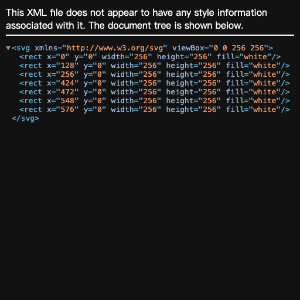
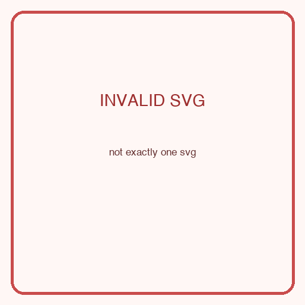
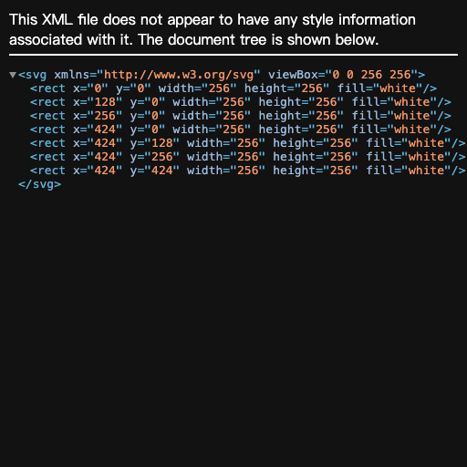

# Gemma 3 270M 基于 LoRA 的 SVG 徽标生成

- 姓名：敖炜
- 学号：202521080810

## 摘要

原始训练文件含 219 行，其中两行仅为冲突的 placeholder，训练时不修改源文件而过滤它们。其余 217 条固定拆为 195 条训练和 22 条开发数据；17 条最终验证集完全隔离。LoRA 将总 reward 从 0.0235 提高到 0.2882，但人工渲染显示多数可解析输出仍退化为单色背景，因此本报告把提升限定为格式稳定性，而不宣称高质量图形生成。

## 1. 数据与方法

原始数据包含 219 条训练记录和 17 条最终验证样本；两条 user prompt 仅为 placeholder 且目标冲突，训练时程序化过滤，源 JSONL 保持不变。其余数据内部固定划分 22 条开发样本用于超参数筛选和早停；公开验证集不参与训练或模型选择。所有输入使用基座模型自带 chat template，损失只计算 assistant 的 SVG token。

采用 PEFT LoRA，仅作用于 q_proj、k_proj、v_proj、o_proj。训练设备为 Apple M4 MPS，不使用量化；batch size 为 1，并使用梯度累积和梯度检查点。最终课程式目标保留每个源 SVG 的前三个可见图元，以降低 270M 模型的序列难度；这是训练时派生视图，原始 JSONL 未修改。训练优化的是监督交叉熵，reward 只用于选择和分析，因此本项目不声称进行了强化学习。

## 2. Reward 设计

| 分项 | 权重 | 程序化检查 |
|---|---:|---|
| 语法与安全 | 30% | 单一 SVG、XML 可解析、xmlns、无脚本/外链/事件处理器 |
| 几何有效性 | 20% | viewBox、有限数值、主体坐标与尺寸合理 |
| 结构与样式 | 15% | 可见图元、元素数量、显式颜色和调色板规模 |
| 提示词保真度 | 25% | 提示颜色、可验证图元词和基本构图覆盖 |
| 反退化 | 10% | 截断、模板泄漏、异常长度和重复结构 |

解析失败或包含主动内容的 SVG 被设置总分上限，避免用关键词堆砌绕过有效性检查。该 reward 无法可靠判断抽象图标语义和整体美感，因此最终仍需人工检查渲染图。

## 3. 实验

| 实验 | rank | 学习率 | 长度 | 样本 | epoch | 内部 eval loss | 耗时(s) |
|---|---:|---:|---:|---:|---:|---:|---:|
| E0 default | 8 | 2.0e-04 | 2048 | 110 | 1.0 | 1.1858 | 513.7 |
| E1 r=4 | 4 | 2.0e-04 | 2048 | 110 | 1.0 | 1.1824 | 524.3 |
| E2 r=16 | 16 | 2.0e-04 | 2048 | 110 | 1.0 | 1.1859 | 559.7 |
| E3 lr=1e-4 | 8 | 1.0e-04 | 2048 | 110 | 1.0 | 1.3055 | 562.4 |
| E4 lr=5e-4 | 8 | 5.0e-04 | 2048 | 110 | 1.0 | 1.0509 | 551.9 |
| E5 len=3072 | 8 | 2.0e-04 | 3072 | 110 | 1.0 | 1.3901 | 632.1 |
| E6 full-4ep | 4 | 5.0e-04 | 2048 | 195 | 4.0 | 0.7251 | - |
| E7 seed=123 | 4 | 5.0e-04 | 2048 | 195 | 1.0 | 0.9051 | - |
| E8 shortest-110 | 4 | 2.0e-04 | 1536 | 110 | 3.0 | 0.9573 | 670.9 |
| E9 six-elements | 4 | 2.0e-04 | 1536 | 195 | 3.0 | 0.7196 | 705.4 |
| E10 final-3elem | 4 | 2.0e-04 | 1024 | 195 | 2.0 | 0.6773 | 356.7 |

## 4. 最终验证结果

| 指标 | 基座 | LoRA | 配对差值 | 95% bootstrap CI | 改善/持平/退化 |
|---|---:|---:|---:|---:|---:|
| 总 reward | 0.0235 | 0.2882 | 0.2647 | [0.1971, 0.3206] | 14/3/0 |
| 有效性 | 0.0688 | 0.7028 | 0.6340 | [0.4633, 0.7890] | 14/3/0 |
| 保真度 | 0.0550 | 0.1817 | 0.1267 | [0.0377, 0.2104] | 11/3/3 |

基座 fatal rate 为 100.0%，LoRA fatal rate 为 17.6%。由于验证集仅 17 条，置信区间和逐例方向比单一均值更重要。

## 5. 案例与 Goodhart 检查

PDF 版本展示四组 reference/base/LoRA 渲染对比：指标明显改善、轻微改善、无变化以及 fidelity 退化。人工检查发现，LoRA 多数输出虽使用正确 namespace 并完整闭合，却退化为重复单色圆或画布外图元。Reward v2 因此新增正确 namespace、画布内前景、巨型背景与重复图元检查并给退化输出设置 0.35 上限。即便如此，分数提升主要仍来自 validity。

| 样本 | total: base→LoRA | fidelity: base→LoRA | 人工结论 |
|---:|---:|---:|---|

| 3 | 0.0000→0.3500 | 0.0000→0.3611 | 总分明显提高，但图形落在画布外；改善主要是正确 namespace 与闭合结构，并非视觉成功。 |
| 0 | 0.1000→0.3500 | 0.3600→0.3000 | 总分轻微提高，但仅生成重复的浅色圆，提示保真度反而下降。 |
| 5 | 0.0000→0.0000 | 0.0000→0.0000 | 基座与 LoRA 都未生成唯一完整 SVG，是明确的无变化失败。 |
| 14 | 0.1000→0.3500 | 0.2875→0.0000 | LoRA 输出可解析却是空白画布，fidelity 明显退化，构成典型 Goodhart 反例。 |

### 样本 3

| 参考目标 | 基座 | LoRA |
|---|---|---|
|  |  |  |

总分明显提高，但图形落在画布外；改善主要是正确 namespace 与闭合结构，并非视觉成功。

### 样本 0

| 参考目标 | 基座 | LoRA |
|---|---|---|
|  |  |  |

总分轻微提高，但仅生成重复的浅色圆，提示保真度反而下降。

### 样本 5

| 参考目标 | 基座 | LoRA |
|---|---|---|
|  |  |  |

基座与 LoRA 都未生成唯一完整 SVG，是明确的无变化失败。

### 样本 14

| 参考目标 | 基座 | LoRA |
|---|---|---|
|  |  |  |

LoRA 输出可解析却是空白画布，fidelity 明显退化，构成典型 Goodhart 反例。

## 6. 局限与结论

270M 模型容量极小，且前三图元课程牺牲了细节覆盖。LoRA 将 fatal rate 从 100% 降到 17.6%，证明格式学习有效；但 14 个非致命输出中仍有 13 个触发背景/画布退化上限，不能视为语义生成成功。后续应使用更强模型、结构化 SVG tokenization、分阶段增加图元，并加入栅格感知或视觉模型评测。

## 7. 复现

```bash
uv venv --python 3.12 .venv
uv pip install --python .venv/bin/python -r requirements.txt
.venv/bin/python student_kit/audit_data.py
.venv/bin/python student_kit/train_peft.py --config train_config.yaml
.venv/bin/python student_kit/eval_self.py --model gemma3-270m-it --adapter adapter
.venv/bin/python student_kit/analyze_results.py results.json
```

完整逐样本输出、reward 分项、环境版本和固定解码参数见 `results.json`。
