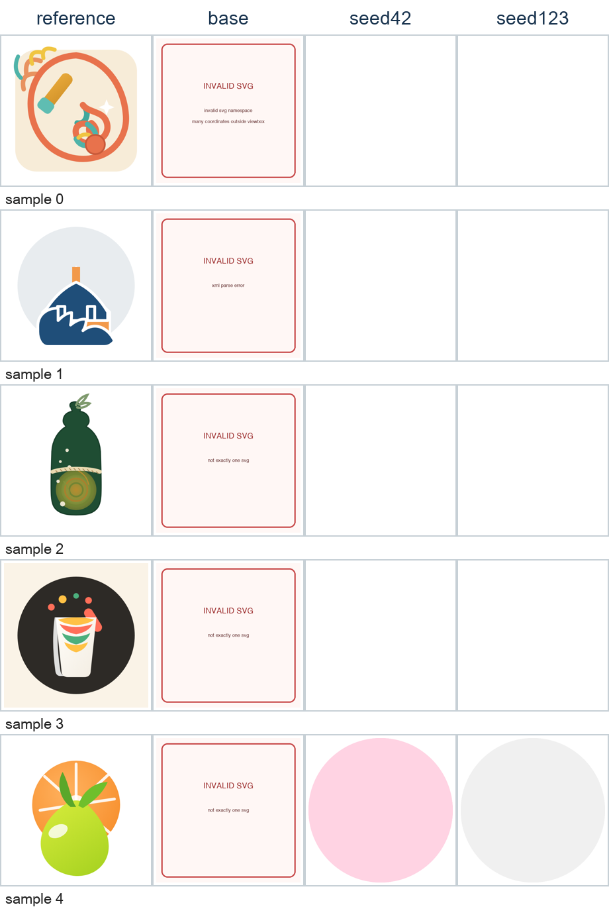
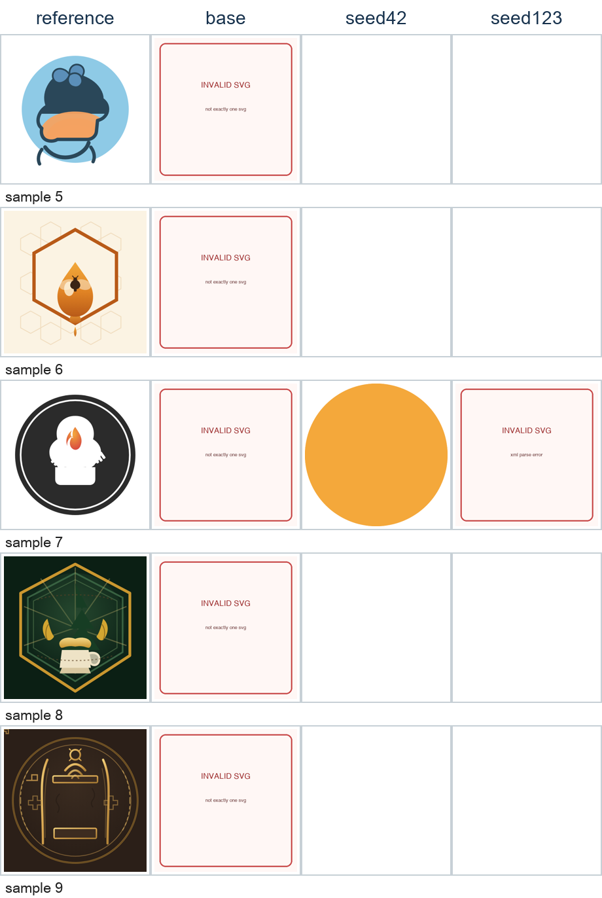
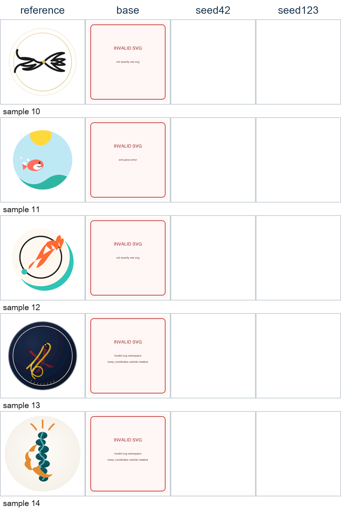
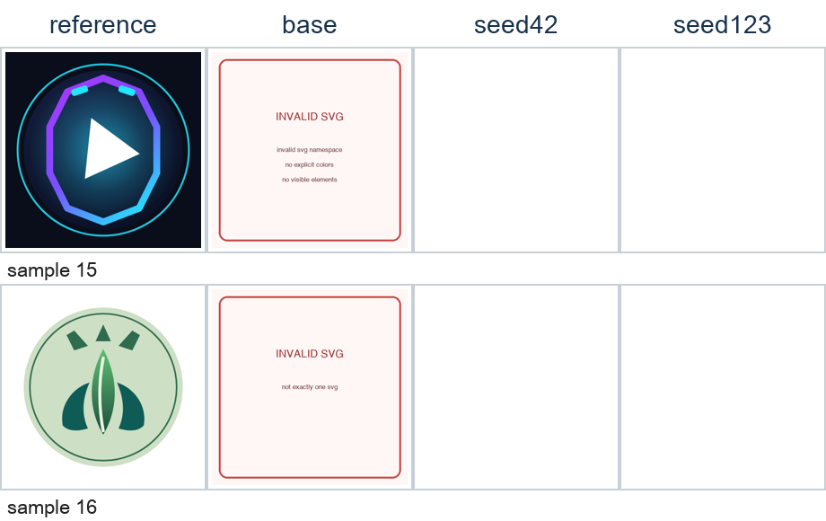

# Gemma 3 270M 完整 SVG LoRA 微调与审计

- 姓名：敖炜
- 学号：202521080810
- 作业仓库：https://github.com/ao-wei/gemma3-270m-svg-lora-partb
- 数据来源：https://github.com/roboticcam/logo-detailed-prompt

## 摘要

本项目从零补齐 student kit，并在 Apple M4 MPS 上用 PEFT LoRA 训练 Gemma 3 270M。原始 219 条训练记录中两条 placeholder 在加载时过滤，源文件不修改；17 条验证集不参与学习率、epoch、seed 或 checkpoint 选择。三图元模型仅作为预热阶段，最终主 adapter 从该权重出发，用全部 217 条原始完整 SVG、3584 token 上限、seed 42 再训练一轮；seed 123 仅用于稳健性复跑。

最终主模型把 fatal rate 从 100.0% 降到 0.0%，总 reward 从 0.0235 提高到 0.3638；但 quality pass rate 为 0.0%，人工审计也判定视觉有效输出为 0/17。因此可支持的结论仅是 SVG 外层格式更稳定，不能宣称模型完成了提示驱动的徽标生成。

## 1. 数据边界与训练方法

训练加载器使用模型自带 chat template；system、user 与 padding token 的标签全部为 -100，仅 assistant SVG token 参与交叉熵。完整 chat 最大长度为 3535，最终 max_length=3584，所有最终训练记录零截断。LoRA rank=4、alpha=16、dropout=0.05，仅作用于 q_proj/k_proj/v_proj/o_proj；batch size=1、梯度累积=8、梯度检查点开启。训练是监督微调，reward 只用于内部选择和分析，并非 RL。

为了在 16GB MPS 上保留完整 SVG，训练使用精确的分块词表投影损失：按 token 块计算 lm_head 与交叉熵，再按有效 assistant token 总数归一化。数值检查与原始全 logits loss 的绝对差为 0。precision:auto 仅对明确 BF16 算子不兼容错误重启 FP32；OOM 不会伪装成兼容问题。

## 2. Reward v3 与 pass 定义

总分公式为 0.30×语法安全 + 0.20×几何 + 0.15×结构样式 + 0.25×提示保真 + 0.10×反退化。提示保真内部为颜色 45%、图形 25%、空间 20%、构图 10%；不存在可靠空间要求时对其他分项重新归一化。空间关系只在元素可唯一匹配时评分，歧义标记 unscorable。stroke-width 必须有限、非负且不超过 viewBox 短边 10%。

- valid pass：非 fatal 且 validity ≥ 0.8。
- quality pass：valid pass、total ≥ 0.5、fidelity ≥ 0.3，且无背景/空白退化。
- 致命 XML/安全错误有总分上限；背景、画布外与重复退化进入 violations。

## 3. 补充实验与内部选择

| 实验 | 目标/seed | 训练/开发 | lr | 长度 | eval loss | 峰值 driver GiB | 秒 | 截断 |
|---|---|---:|---:|---:|---:|---:|---:|---:|
| E10 stage1 | 3 visible elements | 195/22 | 2.0e-04 | 1024 | 0.6773 | - | 356.7 | - |
| E11 | full SVG, lr=5e-5 | 195/22 | 5.0e-05 | 3584 | 1.0408 | 3.85 | 826.1 | 0 |
| E12 | full SVG, lr=1e-4 | 195/22 | 1.0e-04 | 3584 | 0.9875 | 3.85 | 659.7 | 0 |
| E13 | full SVG, seed=42 | 217/0 | 5.0e-05 | 3584 | - | 3.84 | 788.7 | 0 |
| E14 | full SVG, seed=123 | 217/0 | 5.0e-05 | 3584 | - | 3.82 | 661.4 | 0 |

E11/E12 只在固定 22 条内部开发集比较。E12 fatal rate=31.8% 且 fidelity 未改善，触发预声明排除门槛；选择 E11 的 lr=5.0e-05。E13/E14 均从 stage1 初始权重重新训练全部 217 条；seed 42 预先指定为主模型。

## 4. 最终 17 条验证结果

| 模型 | total | validity | fidelity | fatal rate | valid pass | quality pass |
|---|---:|---:|---:|---:|---:|---:|
| Base | 0.0235 | 0.0688 | 0.0509 | 100.0% | 0.0% | 0.0% |
| Stage1（三图元） | 0.2882 | 0.7028 | 0.1890 | 17.6% | 64.7% | 0.0% |
| E13 seed42 | 0.3638 | 0.7539 | 0.0621 | 0.0% | 11.8% | 0.0% |
| E14 seed123 | 0.3432 | 0.7045 | 0.0383 | 5.9% | 5.9% | 0.0% |

seed42 相对 base 的配对结果：

| 指标 | 均值差 | bootstrap 95% CI | 改善/持平/退化 |
|---|---:|---:|---:|
| total | 0.3402 | [0.3088, 0.3795] | 17/0/0 |
| validity | 0.6852 | [0.6146, 0.7475] | 17/0/0 |
| fidelity | 0.0113 | [-0.0631, 0.0864] | 7/7/3 |

## 5. 全量视觉审计与 Goodhart

全部 17 条均人工检查 reference/base/seed42/seed123。seed42 视觉有效 0/17、背景单图元 2/17；seed123 视觉有效 0/17、背景单图元 1/17。程序化 reward 对可解析但空白/画布外输出仍给出约 0.35，总分因语法分被抬高，属于明确 Goodhart 反例。逐样本判断见 `manual_review.json`。









## 6. 结论与局限

完整 SVG 继续训练确实把 seed42 的 fatal rate 降至 0，并且 34 个独立复验输出全部一致；但模型学习到的是高度重复、坐标为负的模板，几乎没有前景落在画布内。fidelity 的配对置信区间跨 0，两个 seed 的 quality pass 都为 0。270M 容量、长 SVG token 序列与纯文本交叉熵共同限制了语义构图。后续应采用更强基座、语法约束解码、结构化 SVG 表示和基于栅格图像的感知损失/评测。

## 7. 复现与验收

```bash
uv venv --python 3.12 .venv
uv pip install --python .venv/bin/python -r requirements.txt
.venv/bin/python -m unittest discover -s tests -v
.venv/bin/python student_kit/train_peft.py --config train_config.yaml
.venv/bin/python student_kit/eval_self.py --adapter adapter --output results.json
.venv/bin/python student_kit/analyze_results.py results.json
.venv/bin/python student_kit/build_visual_audit.py
.venv/bin/python student_kit/verify_artifacts.py --results results.json --repro runs/repro_full.json --adapter adapter
```

验收：测试 27/27；新进程 adapter 加载=True；schema v2=True；确定性复验 base 17/17、tuned 17/17。

## 附录 A：最终 train_config.yaml

```yaml
model_path: gemma3-270m-it
train_file: train.jsonl
output_dir: runs/e13_full217_seed42
init_adapter_path: adapter_curriculum_stage1
seed: 42
dev_size: 0
max_train_samples: null
drop_uninformative_prompts: true
simplify_targets: false
require_no_truncation: true
max_length: 3584
eval_max_length: 3584
precision: auto
auto_precision_fallback: true
batch_size: 1
gradient_accumulation_steps: 8
gradient_checkpointing: true
loss_chunk_size: 256
num_train_epochs: 1
learning_rate: 5.0e-05
weight_decay: 0.01
warmup_ratio: 0.05
lr_scheduler_type: cosine
max_grad_norm: 1.0
logging_steps: 5
eval_steps: 25
save_steps: 25
early_stopping: false
early_stopping_patience: 1
lora_r: 4
lora_alpha: 16
lora_dropout: 0.05
target_modules:
- q_proj
- k_proj
- v_proj
- o_proj
```

## 附录 B：哈希与结果 schema

- 主 adapter SHA-256：`1ceedb3bfa3278a26e862b02b1933516a78c40586e8136c25dc78e9397cb64b5`
- train.jsonl SHA-256：`b8c90a46a0292bdfac3e0a9800f30bd8ceeacad05f0e3fab5a9de91ec84d8d18`
- valid.jsonl SHA-256：`43f66b004843b91691d72c2949fb9dbf075408288d9a0a2a81a2337062bfce31`
- results schema v2：每条样本含 raw_text、svg、reward、passes.valid、passes.quality；汇总含 pass_rate、valid_pass_rate、quality_pass_rate。
- 关键产物：`results.json`、`results_seed123.json`、`results_stage1.json`、`render_manifest.json`、`manual_review.json`。
